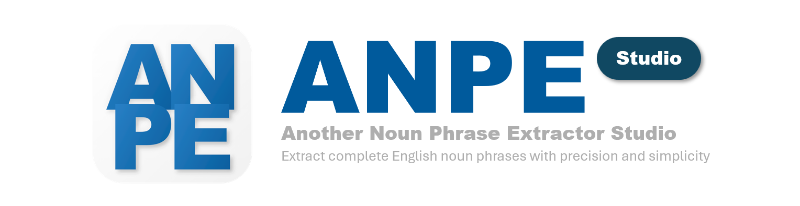
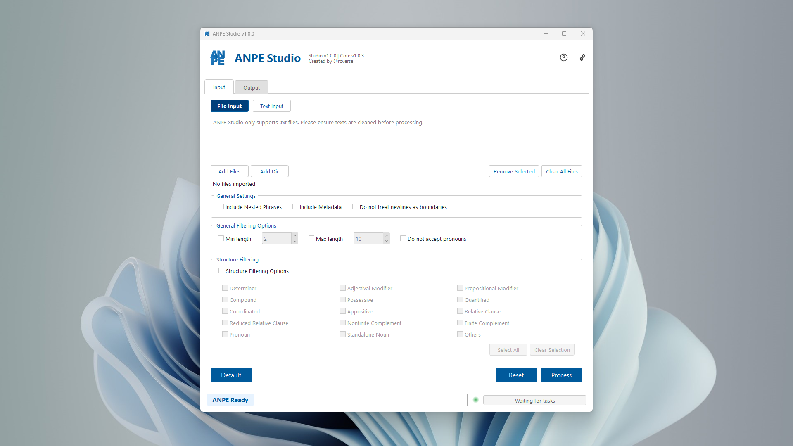
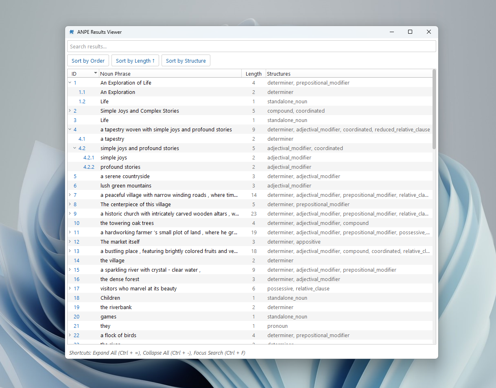

  

<h1 align="center">ANPE Studio - Another Noun Phrase Extractor</h1>

  <strong>One-click solution to extract complete English noun phrases</strong>

  
  
  
  
  

  No code? No problem. ANPE Studio provides an intuitive graphical interface for the <a href="https://github.com/rcverse/another-noun-phrase-extractor">ANPE (Another Noun Phrase Extractor)</a> Python library. It provides a user-friendly way to extract noun phrases from text—<strong>no coding required</strong>.

## ✨ Features

ANPE Studio packs a range of features:

* **✍️ Flexible Input:** Paste text directly or process single/multiple `.txt` files.
* **⚙️ Granular Control:** Configure extraction options like including nested phrases, adding metadata (source filename), and handling sentence boundaries.
* **🔍 Powerful Filtering:** Refine results by filtering phrases based on word count (min/max length) or specific grammatical structures (e.g., *Determiner*, *Compound*, *Possessive*).
* **📊 Clear Results View:** Displays extracted phrases in a structured, hierarchical tree, revealing relationships between nested phrases. You may also pop out the results into a separate, resizable window for focused analysis or comparison.
* **💾 Versatile Export:** Save your extracted noun phrases to multiple formats: plain text (`.txt`), comma-separated values (`.csv`), or structured data (`.json`).
* **📚 Easy Model Management:** Install, uninstall, and manage required spaCy and Benepar language models directly within the app via Settings (internet connection needed).
* **🔄 Core Library Updates:** Check for and install updates to the underlying ANPE extraction engine with a single click in Settings.
* **📜 Detailed Logging:** A toggleable log panel (accessible from the status bar) provides insights into the extraction process and aids in troubleshooting.

## 📸 Screenshots

### Main Input Area

*Caption: The main input tab where users can paste or type their text for analysis.*

### Analysis Output Display

*Caption: The output tab showcasing the structured results of the NLP analysis.*

### Application Settings

*Caption: The settings page, likely showing model management or other configuration options.*

### Detached Result Viewer

*Caption: A detached window for viewing detailed analysis results, allowing for a flexible workspace.*

### Log Panel

*Caption: The application's log panel, useful for debugging and monitoring processes.*

## 🚀 Getting Started

**Important Note on Installation Size:**

ANPE Studio is designed to be a **self-contained** application, meaning it includes its own Python environment and all necessary (and sometimes large) libraries like spaCy, Benepar, and their associated language models (which can involve PyTorch). This ensures that the application works out-of-the-box for everyone, especially users who may not have Python installed or are not familiar with managing Python packages.

*   **Approximate Size:** Due to these bundled components, the installed application can take up a significant amount of disk space:
    *   **Windows:** Around 1.8 GB
    *   **macOS:** Around 1 GB
*   **Alternative for Python Users:** If you are comfortable with Python environments and package management, you can avoid this large installation. Instead, clone the [ANPE Studio repository](https://github.com/rcverse/anpe-studio) and run the application directly using `python -m anpe_studio` from the repository's root directory after creating a virtual environment and installing dependencies listed in `requirements.txt` into your own Python environment.

### Download ANPE Studio
Visit the **[Releases Page](https://github.com/rcverse/anpe-studio/releases)** and download the latest installer for your operating system.

### Install ANPE Studio
#### For Windows
   * Run the downloaded `.exe` setup file.
   * Follow the on-screen prompts. The installer creates a self-contained folder for ANPE Studio (preventing conflicts with other Python tools you might have) and downloads the necessary base language models.
   
#### For MacOS
   * Run the downloaded `.dmg` file.
   * Drag the ANPE Studio icon into the application folder.
   * **Running for the First Time (Unnotarized App):** Since ANPE Studio is not yet notarized by Apple, you will need to grant it permission to run.
      > ⚠️ Note that currently the setup wizard's UI is not compatible with dark mode. Please disable dark mode when running the setup wizard.
     * After dragging the app to your Applications folder, **right-click (or Ctrl-click)** the ANPE Studio icon and select **'Open'**.
     * You will likely see a warning message. Click **'Open'** again in the warning dialog to confirm you want to run the application.
     * *Alternatively, if the above doesn't work, you might need to go to Apple menu > 'System Settings' (or 'System Preferences' on older macOS versions), then 'Privacy & Security'. Scroll down and you should see a message about "ANPE Studio" being blocked. Click the 'Open Anyway' button.*
   * Start ANPE Studio from Applications. On the first launch, it will guide you through setting up its necessary environment and downloading base models.

### Uninstall
#### For Windows
   You can directly uninstall by using the Application management in the control panel or setting.

#### For MacOS
   A utility script named `clean_anpe.sh` is available in the `/Extras` folder inside the downloaded `.dmg` file. You can access this by opening the `.dmg` again and navigating to this folder (scroll down). This script helps remove the application and its related data if you choose to uninstall it.

   >To run this script, open your Terminal ⌨️, input "sh", drag the .sh file into the terminal window, and press enter to run.

## 💡 Basic Usage Guide

1. Open ANPE Studio and go to the **Input** tab.
2. Choose how to add your text:
   * **Add Files:** Click "Add Files..." or "Add Directory..." to select one or more `.txt` files.
   * **Paste Text:** Copy your text and paste it into the large text area.
3. Adjust **Configuration** options as needed (e.g., check "Include nested phrases", set length filters).
4. Click the **Process** button. You can monitor progress in the status bar at the bottom.
5. After processing, you will be directed to the **Output** tab. The extracted noun phrases will appear in the tree view. If you processed multiple files, use the dropdown menu at the top to switch between file results.
6. Click the **Export** button to save the currently viewed results. Choose your desired format (`.txt`, `.csv`, `.json`) and save location.

For a more detailed exploration of all features, please refer to the built-in **Help Guide** (the question mark icon on the right upper corner).

---

## ❓ Troubleshooting

Encountering issues? Here are a few common solutions:

* **Model Downloads:** Ensure you have a stable **internet connection** when installing/updating models (during setup or via Settings). Firewalls might sometimes block downloads.
* **Model Errors:** If extraction fails with model-related errors, try the **Settings > Models > Clean Models** tool to reset them, then try installing again.
* **Check Logs:** Click the Status Bar at the bottom of the main window to toggle the **Log Panel**. It often contains detailed error messages.
* **Report Bugs:** If problems persist, please check existing [issues](https://github.com/rcverse/anpe-studio/issues) or [report a new one](https://github.com/rcverse/anpe-studio/issues/new). Include details from the Log Panel if possible!

## 📄 License

This project is distributed under the GNU General Public License v3.0. See the [LICENSE](LICENSE) file for full details.

## 🙌 Acknowledgements

ANPE Studio is made possible by the excellent work of the developers and communities behind the following open-source projects and tools:

### 🛠️ Core Runtime Libraries

The application installer bundles these core libraries so you don't have to manage them separately:

* **[ANPE Core](https://github.com/rcverse/another-noun-phrase-extractor)**: The fundamental noun phrase extraction engine.
* **[PyQt6](https://riverbankcomputing.com/software/pyqt/)**: The framework used to build the graphical user interface.
* **[spaCy](https://spacy.io/)**: Provides core natural language processing capabilities.
* **[Benepar](https://github.com/nikitakit/self-attentive-parser)**: Enables advanced constituency parsing needed for detailed phrase structure.
* **[NLTK](https://www.nltk.org/)**: Used by Benepar for managing its language models.

### 📦 Installer Creation & Distribution

Creating a user-friendly, distributable application relies on these powerful tools:

* **[PyInstaller](https://pyinstaller.org/)**: Used to package the Python application and its dependencies into a standalone executable for Windows.
* **[py2app](https://py2app.readthedocs.io/)**: Utilized for creating macOS application bundles.
* **[python-build-standalone](https://github.com/astral-sh/python-build-standalone)**: This project by Astral SH provides pre-built, distributable Python versions. I leverage these builds to create a consistent Python environment, particularly for my macOS distributions, simplifying the packaging process.
* **[create-dmg](https://github.com/create-dmg/create-dmg)**: A shell script to build customizable `.dmg` files for macOS distribution.

I am immensely grateful for the contributions of all these projects to the open-source ecosystem, enabling me to build and share ANPE Studio.

## 🎓 Citation

If ANPE Studio aids your research or project work, I kindly request that you cite the core **[ANPE library](https://github.com/rcverse/another-noun-phrase-extractor#citation)** that performs the extraction. Citation details can be found on the ANPE library's repository page.

## 💻 Development

* Please see the [**Developer README (/DEV_README.md)**](/DEV_README.md) for detailed developing-related information.
